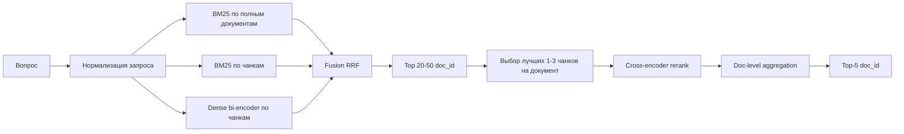
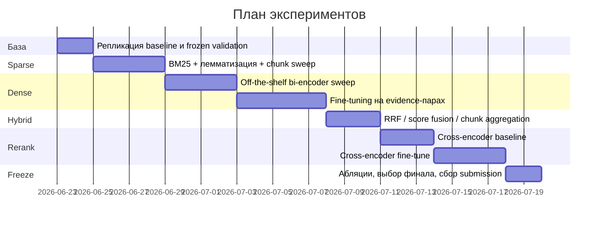

# План решения retrieval-задачи для корпуса судебных актов НПФ

## Executive summary

Для этой задачи я бы **не ставил в центр один “лучший” retriever по полным документам**. Корпус маленький по объёму, но трудный по структуре: документы длинные, однотипные, написаны канцелярским языком и отличаются нюансами мотивировки; в legal RAG это как раз тот случай, где качество ответа почти полностью определяется качеством retrieval, потому что ошибка на первом шаге легко превращается в уверенную галлюцинацию генератора. Для таких корпусов в литературе и в практических retrieve→rerank пайплайнах лучше всего работает **многостадийная схема**: сначала широкий recall-oriented candidate generation, затем более “дорогой” точный rerank; отдельно legal NLP подчёркивает, что длинные специализированные документы и vocabulary mismatch между запросом и релевантным фрагментом — ключевая причина провалов обычных поисковиков. citeturn7search6turn2search11turn7search1turn7search5turn5search1

Если бы мне нужно было собрать сильное решение под лидерборд, я бы делал ставку на **passage-centric hybrid retrieval**:

1. **Sparse-ветка**: BM25 по полным документам и по чанкам.
2. **Dense-ветка**: bi-encoder по тем же чанкам.
3. **Fusion**: объединение рангов через RRF.
4. **Rerank**: cross-encoder по top-N документам/лучшим чанкам каждого документа.
5. **Финальный doc-level score**: агрегировать chunk-level сигналы обратно в `doc_id`.

Такой дизайн напрямую согласуется с классическими свойствами BM25, с практикой dense retrieval в dual-encoder постановке, с retrieve-and-rerank рекомендациями Sentence Transformers и с legal retrieval работами, где passage retrieval и reranking оказываются важнее, чем попытка сразу “угадать” лучший целый документ. citeturn0search0turn0search2turn0search3turn5search1turn5search10turn7search2turn7search11

Главный скрытый актив в ваших данных — это **`gold_evidence_text` и его позиция в документе**. Это почти готовая supervision-разметка не только для document retrieval, но и для **обучения passage retriever и reranker**: положительным объектом должен считаться не просто весь `gold_doc_id`, а окно вокруг evidence-фрагмента. Это, на мой взгляд, самый важный рычаг улучшения относительно baseline. Под supervised dense retrieval логика хорошо описана в DPR; для более слабой supervision или если меток мало, полезно сравнить supervised би-энкодер с сильными off-the-shelf multilingual embedding-моделями и с unsupervised dense retrieval вроде Contriever. citeturn0search2turn1search16turn4search2turn4search3

При этом из-за размера корпуса **ANN-индекс как необходимость здесь почти не нужен**: на 468 документах, и даже на нескольких тысячах passage-чанков, exact retrieval на CPU будет стоить дёшево; FAISS нужен скорее как удобный единый интерфейс и задел на масштабирование, а HNSW/IVF/PQ оправданы уже при росте индекса и/или при жёстких latency-ограничениях. FAISS официально поддерживает как exact, так и approximate similarity search, а HNSW даёт типичный recall/latency trade-off при масштабировании. citeturn0search1turn6search1turn1search1

## Что в задаче определяет архитектуру retrieval

По условию задачи у нас `documents.csv` с 468 судебными актами, `train.csv` с 700 вопросами, `test.csv` с 350 вопросами, целевая метрика — **Recall@5**, а на каждый вопрос есть ровно один правильный документ. В приложенном проекте baseline реализован как простой TF-IDF retrieval, а в проектном EDA зафиксирована его слабость на этой предметной области: он даёт заметно ограниченный Recall@5 и особенно плохо справляется с темами, где требуется смысловое совпадение или различение почти одинаковых мотивировок. По той же проектной EDA-разметке видно, что evidence-фрагменты часто длинные и лежат не только в начале документа, а train-разметка покрывает лишь часть корпуса, что делает document-level memorization опасной стратегией.  

Из этого следуют четыре практических вывода.

Во-первых, **первый этап должен быть recall-oriented**, а не “сразу precision”. Recall@5 на leaderboard означает, что нам важнее не идеальный top-1, а максимально надёжное попадание нужного документа в пятёрку. Следовательно, candidate generation должен быть широким, избыточным и гибридным.

Во-вторых, **нельзя полагаться только на full-document matching**. В legal NLP длинные документы и сложный специализированный язык системно ухудшают retrieval; legal retrieval работы специально выделяют paragraph- и passage-level постановки именно потому, что релевантность часто локализована в небольшой части длинного дела. citeturn2search11turn7search2turn7search5

В-третьих, **лексический поиск обязателен**, но одного его недостаточно. BM25 остаётся одним из самых сильных и устойчивых sparse baselines благодаря term weighting и length normalization, особенно на корпусах с длинными документами; однако legal passage retrieval отдельно отмечает vocabulary mismatch между запросом и целевым фрагментом, а dense retrieval как класс был предложен именно для преодоления этого разрыва. citeturn0search0turn7search1turn0search2turn1search16

В-четвёртых, **разметка evidence делает возможным полноценный supervised retrieval**, а не просто unsupervised semantic search. Оригинальная DPR-постановка показывает, что dual-encoder retrieval хорошо обучается на парах “вопрос → релевантный passage”, а SBERT-подход даёт эффективные sentence/passage embeddings для semantic search; в вашем случае такой supervision есть прямо в train, и этим надо пользоваться. citeturn0search2turn0search3turn5search18

Полезно формализовать это в виде design matrix.

| Наблюдение по данным | Что это значит для retrieval | Практическое следствие |
|---|---|---|
| Документы длинные и однотипные | Полный документ слишком груб как unit retrieval | Индексировать и документы, и passage-чанки |
| Вопросы короткие | Мало лексических якорей | Добавить dense retrieval и при необходимости query reformulation |
| Есть `gold_evidence_text` | Есть supervision на уровне passage | Учить bi-encoder и cross-encoder на evidence-окнах |
| Метрика Recall@5 | Нужен высокий recall до rerank | Кандидатов брать из нескольких ретриверов и фьюзить |
| Train покрывает только часть `doc_id` | Лёгкое переобучение на “известные документы” | Основная валидация должна быть grouped by `gold_doc_id` |

Отдельно отмечу ограничения, которые **не уточнены** и которые влияют на выбор модели и инженерии:

| Параметр | Статус | Как влияет на решение |
|---|---|---|
| Бюджет вычислений | неуточнено | Определяет, можно ли делать full fine-tuning и rerank глубже 50–100 кандидатов |
| Доступ к GPU | неуточнено | Критичен для bi-encoder/cross-encoder обучения и ColBERT |
| Допустимое время обучения | неуточнено | Определяет ширину grid search и число абляций |
| Допустимая латентность поиска | неуточнено | Определяет, нужен ли ANN и насколько “глубоким” может быть rerank |
| Разрешены ли внешние данные | неуточнено | Влияет на domain adaptation и дополнительное pretraining |
| Разрешены ли внешние предобученные модели | неуточнено | Если да, я бы обязательно тестировал multilingual E5 / BGE-M3 / legal-friendly rerankers |

Поскольку эти параметры не заданы, ниже я предложу план, который работает в трёх режимах: **без внешних моделей**, **с открытыми предобученными моделями**, и **с GPU-aware fine-tuning**.

## Рекомендуемый пайплайн retrieval и rerank



### Предобработка текста

Я бы держал **две параллельные текстовые репрезентации**.

Первая — **lexical view** для sparse retrieval: lowercasing, нормализация пробелов, унификация `ё/е`, кавычек, дефисов, базовая очистка мусора, но без агрессивного удаления юридически значимых токенов. В baseline уже есть простая токенизация и стоп-слова; следующий шаг — аккуратная лемматизация именно для sparse-ветки. BM25 выигрывает от длиновой нормализации и term weighting, но на русском юридическом тексте дополнительная нормализация форм слов часто даёт ощутимый выигрыш за счёт снижения морфологического шума. Сам baseline notebook тоже прямо подсказывает лемматизацию как первый апгрейд.

Вторая — **semantic view** для dense retrieval: минимально искажающая нормализация, потому что современные bi-encoder модели сами умеют работать с формами слов и контекстом. Для E5-моделей важно соблюдать рекомендованное форматирование с префиксами типа `query:` и `passage:`; для multilingual E5 это официальный usage pattern модели. citeturn4search2turn4search5

Дополнительно я бы извлёк **структурные признаки**, не как основной retrieval-сигнал, а как фичи для rerank или пост-аналитики: тип акта, инстанция, статьи закона, суммы, даты, наличие процессуальных формул. В legal NLP обзорной литературе именно структура и специализированный язык repeatedly фигурируют как причины, почему “обычный NLP pipeline” в праве работает хуже без domain-aware представления. citeturn2search11turn7search0

### Сегментация документов

Мой основной unit retrieval здесь — **не документ, а passage**. Для корпуса такого типа я бы не ограничивался символьными chunk’ами “по 1600 символов”, а сравнил минимум три стратегии:

| Стратегия | Когда полезна | Риск |
|---|---|---|
| Символьные overlap chunks | Быстро сделать baseline | Плохо совпадает с логическими границами |
| Line-window chunks | Хорошо подходит к судебным актам с переносами и блоками | Нужен careful sweep по размеру окна |
| Paragraph/sentence-aware chunks | Лучшая интерпретируемость | Дороже и чувствительнее к качеству сегментации |

На основании локального просмотра проекта я бы сделал **line-window chunking базовым вариантом** и держал paragraph-aware как альтернативу. Причина простая: судебные акты обычно размечены строками и блоками “УСТАНОВИЛ/ОПРЕДЕЛИЛ/РЕШИЛ”, а evidence в train — это именно точка опоры, вокруг которой можно строить положительные пассажи.

Практически я бы проверял такие окна:

| Chunk unit | Размер | Overlap |
|---|---:|---:|
| line-window | 8 строк | 4 строки |
| line-window | 10 строк | 5 строк |
| line-window | 12 строк | 6 строк |
| paragraph-window | 1–2 абзаца | 50% |
| char-window | 1200–2000 символов | 50% |

Для агрегации chunk→doc я бы не ограничивался `max`. На legal retrieval часто помогает один “правильный” фрагмент, но иногда полезен и второй supporting chunk. Поэтому я бы сравнил как минимум:

- `max(chunk_score)`  
- `mean(top2_chunk_scores)`  
- `max + λ * second_best`  
- `softmax-weighted pooling` по верхним 3 чанкам  
- `doc_score = α*full_doc_score + β*best_chunk_score`

### Candidate generation

#### Sparse retrievers

Первый обязательный кандидат — **BM25**. Это не просто “ещё один baseline”: BM25 остаётся центральным sparse retriever именно потому, что лучше, чем голый TF-IDF, учитывает длину документа и насыщение term frequency. Для длинных юридических актов это особенно важно. citeturn0search0

Я бы запускал не один, а **два sparse-поиска**:

1. **BM25 full-doc**
2. **BM25 chunked**

Если внешние модели запрещены, этот дуэт уже может быть очень сильным, особенно если добавить в sparse-блок ещё один дешёвый источник разнообразия — **char n-gram TF-IDF** как анти-морфологический и анти-опечаточный контроль. Это не “классическая IR-литература must-have”, а прагматичный абляционный baseline для русского.

#### Dense retrievers

Для dense retrieval я бы делал этапы по возрастанию сложности.

Сначала — **off-the-shelf bi-encoders**. Минимальный shortlist:

| Модель | Почему тестировать | Что ожидать |
|---|---|---|
| multilingual E5-base / large | Сильная универсальная multilingual retrieval-линейка | Сильный zero-shot и хороший fine-tune base |
| BGE-M3 | Одна модель поддерживает dense, sparse и multi-vector режимы; работает с 100+ языками и длинными входами до 8192 токенов | Очень удобна как “универсальный швейцарский нож” |
| Contriever | Сильный unsupervised dense retrieval, полезен как low-label baseline | Хороший контроль на случай малого supervised сигнала |
| DPR-style bi-encoder | Нужен как supervised retrieval template | Особенно полезен после fine-tuning на ваших evidence-парах |
| SBERT-style bi-encoder | Эффективный semantic search baseline | Хороший reference point по скорости и качеству |

Это не просто список популярных моделей; каждая из них покрывает отдельную гипотезу. DPR показывает силу supervised dual-encoder retrieval на QA-like задаче. SBERT показывает, как эффективно делать semantic search с sentence/passage embeddings. Contriever полезен там, где supervised data ограничены или domain shift велик. Multilingual E5 и BGE-M3 — современные сильные multilingual embedding-модели; у BGE-M3 особенно ценно то, что одна модель может работать как dense, sparse и multi-vector retriever, что очень удобно для компактного experimentation loop. citeturn0search2turn0search3turn1search16turn4search2turn4search3turn4search15

Затем — **fine-tuning лучшего dense retriever** на train:

- **Positive**: окно вокруг `gold_evidence_text`
- **Additional positive**: весь gold document
- **Hard negatives**: top BM25 non-gold chunks, top dense non-gold chunks, same-topic negatives, near-duplicate legal templates

Это соответствует общей практике hard-negative mining в IR и retrieve-rerank pipelines: hard negatives важнее случайных отрицательных примеров. Sentence Transformers в своих IR recipes тоже делает акцент на hard negatives, в том числе mined by stronger rerankers. citeturn5search19turn5search21

#### Late interaction как продвинутый трек

Если GPU есть и есть время на один high-ceiling эксперимент, я бы обязательно протестировал **ColBERT-like late interaction** или режим **BGE-M3 multi-vector**. Для задачи, где документы почти одинаковы и различаются локальными формулировками, late interaction особенно привлекателен: он сохраняет fine-grained matching между токенами запроса и документа, но остаётся куда дешевле полного cross-encoder matching на всём корпусе. Именно это и было основной идеей ColBERT. citeturn4search0turn4search4

### Гибридизация и fusion

Мой дефолтный способ объединения ретриверов — **RRF**. Причина не в моде, а в том, что RRF не требует сложной калибровки score scales и стабильно работает как fusion rank-lists от разных retrieval систем; в оригинальной работе Cormack et al. RRF “почти всегда” улучшал лучший из объединяемых ранкеров. citeturn8search0

Практически я бы проверял такие фьюжны:

| Fusion | Когда использовать |
|---|---|
| RRF(BM25_doc, BM25_chunk) | первый sanity baseline |
| RRF(BM25_doc, BM25_chunk, Dense_chunk) | основной production candidate generator |
| Weighted sum after score normalization | только если есть стабильная калибровка |
| Two-stage union | если один retriever даёт specialty recall на отдельных темах |

Мой prior здесь очень сильный: **гибрид почти наверняка будет лучше одиночного retriever** именно на юридическом корпусе с vocabulary mismatch и высокой лексической шаблонностью. Это согласуется и с retrieve-rerank практикой, и с общими результатами dense+sparse fusion. citeturn8search0turn5search1turn7search13

### Rerank

Финальный quality jump я бы ожидал именно от **cross-encoder reranking**. Cross-encoder совместно кодирует query и candidate text, поэтому обычно точнее bi-encoder, но слишком дорог для полного first-stage retrieval; именно поэтому его типовая роль — rerank top-k кандидатов. Sentence Transformers прямо рекомендует такой режим использования. citeturn5search0turn5search4turn5search10

Для вашей задачи я бы rerank’ил не документы “как есть”, а пары:

- `query × best_chunk_of_doc`
- `query × second_best_chunk_of_doc`
- опционально `query × full_doc_intro` или `query × full_doc`

Лучший практический компромисс, на мой взгляд, такой:

1. Находим top 20–50 `doc_id` после fusion.
2. Для каждого документа берём 1–3 лучших чанка по BM25/dense score.
3. Cross-encoder выдаёт score по каждой паре.
4. Doc-level rerank score = max или агрегат по 2 лучшим чанкам.

Это особенно хорошо согласуется с legal case retrieval работами, где reranking и element-aware interaction существенно помогают после retrieval-стадии. citeturn7search11turn5search8

Ниже — мой рекомендуемый shortlist моделей по ролям.

| Роль | Базовый вариант | Сильный вариант | Если внешние модели запрещены |
|---|---|---|---|
| Sparse retriever | BM25 | BM25 + SPLADE/BGE-M3 sparse | BM25 + char n-gram TF-IDF |
| Dense retriever | multilingual E5-base | multilingual E5-large / BGE-M3 / ColBERT | пропустить или обучать лёгкий local bi-encoder |
| Fusion | RRF | RRF + learned fusion features | RRF |
| Reranker | small multilingual cross-encoder | fine-tuned legal/russian cross-encoder | local LTR без transformers |

## Детальный план экспериментов

### Принцип организации экспериментов

Я бы не делал “большой поиск всего со всем”. На такой задаче почти всегда выигрывает **каскадный экспериментальный план**, где каждая следующая волна использует лучший вариант из предыдущей.



### Волна воспроизведения и sanity-check

Сначала я бы **заморозил evaluation harness** и ничего не улучшал, пока не уверюсь, что локально стабильно воспроизводятся:

- baseline submission format;
- strict holdout / strict CV;
- метрика Recall@5;
- отсутствие утечек по `gold_doc_id`.

Это критически важно, потому что в вашем проекте уже есть правильная идея валидации: для model selection надо группировать сплиты по `gold_doc_id`, иначе retrieval на “новый вопрос про уже знакомый документ” будет завышать качество и вводить в заблуждение.

### Волна sparse-экспериментов

Здесь я бы последовательно проверил:

| Приоритет | Эксперимент | Что сравнивать | Цель |
|---|---|---|---|
| P0 | BM25 full-doc | `k1`, `b`, токенизация, стоп-слова, лемматизация | заменить слабый TF-IDF baseline |
| P0 | BM25 chunked | chunk unit / size / overlap / aggregation | поднять recall за счёт локального совпадения |
| P1 | char n-gram TF-IDF | `char` vs `char_wb`, 3–5 / 4–6 | дешёвый анти-морфологический контроль |
| P1 | field-aware sparse | текст + статьи + тип акта + инстанция | добавить структурный сигнал |
| P2 | SPLADE или BGE-M3 sparse | sparse neural retriever | проверить, нужен ли neural sparse |

Гипотеза здесь такая: **BM25 full-doc почти наверняка должен стать новой точкой отсчёта**, а **BM25 chunked** должен добавить recall на длинных документах, где запрос лучше совпадает с локальным мотивировочным фрагментом, а не со всем актом целиком. Это согласуется и с базовой BM25-теорией, и с legal passage retrieval постановками. citeturn0search0turn7search2turn7search5

### Волна dense off-the-shelf

После этого я бы сравнил zero-shot dense retrieval. Ключевой вопрос здесь не “какая модель моднее”, а **какая лучше переносится на короткий русский юридический вопрос и длинный legal passage**.

| Приоритет | Модель | Индексация | Гипотеза |
|---|---|---|---|
| P0 | multilingual E5-base | chunk | лучший стартовый zero-shot dense baseline |
| P0 | multilingual E5-large | chunk | возможно лучший recall, если есть ресурс |
| P0 | BGE-M3 | chunk | сильная multilingual и long-input опция |
| P1 | Contriever | chunk | проверка unsupervised transfer |
| P1 | SBERT-style multilingual model | chunk | контроль по скорости/качеству |
| P2 | full-doc dense retrieval | document | проверить, не проигрывает ли passage index |

Здесь я бы сразу отсёк full-doc dense retrieval, если он стабильно уступает chunked dense retrieval по strict CV. Практика legal retrieval скорее подсказывает обратное: passage-level индекс обычно даёт более управляемый сигнал на длинных делах. citeturn7search2turn7search5

### Волна supervised dense retrieval

Здесь начинается самый ценный для этой задачи этап.

Я бы обучал bi-encoder на парах:

- **query → evidence window** как основной positive;
- **query → full gold doc** как auxiliary positive;
- **hard negatives** из топов BM25 и dense;
- **same-topic hard negatives** как отдельный mining source.

С точки зрения loss-функций я бы сравнивал:

| Loss / training setup | Когда полезен |
|---|---|
| Multiple Negatives Ranking | сильный дефолт для bi-encoder retrieval |
| Triplet / contrastive | если hard negatives качественные |
| Margin-MSE / distillation from reranker | если появляется хороший cross-encoder teacher |

DPR задаёт хорошую исходную supervised dual-encoder логику, а Sentence Transformers даёт практические recipes для IR training и hard negatives. citeturn0search2turn5search19turn5search15

### Волна fusion и агрегации

После появления сильного sparse и сильного dense я бы системно тестировал fusion.

| Приоритет | Что меняем | Варианты |
|---|---|---|
| P0 | Fusion method | RRF, weighted score sum |
| P0 | Fusion members | BM25_doc + BM25_chunk; + Dense_chunk |
| P1 | Chunk→doc aggregation | max, top2 mean, max+second, softmax-top3 |
| P1 | Candidate breadth | retrieve 20 / 50 / 100 до rerank |
| P2 | Topic prior | мягкий topic prior как feature, не как hard filter |

Здесь моя рабочая гипотеза: **победит RRF из двух sparse источников и одного dense источника**, а затем rerank уже доберёт precision. RRF особенно хорош тем, что не требует надёжной калибровки score шкал. citeturn8search0

### Волна rerank

Здесь два сценария.

**Минимальный сценарий**: взять готовый multilingual cross-encoder и просто rerank top-20 или top-50 кандидатов.  
**Боевой сценарий**: fine-tune cross-encoder на ваших query/evidence pairs и hard negatives.

Для reranker я бы проверял:

| Приоритет | Эксперимент | Варианты |
|---|---|---|
| P0 | Rerank depth | 20 / 50 / 100 |
| P0 | Input unit | best chunk / best 2 chunks / full doc intro |
| P1 | Fine-tune cross-encoder | pointwise BCE / pairwise margin |
| P1 | Feature fusion after rerank | raw CE score vs CE + sparse + dense features |
| P2 | Cascaded rerank | lightweight CE → heavyweight CE |

Ожидаемый результат здесь такой: **самый сильный single improvement после hybrid candidate generation даст именно cross-encoder rerank**, потому что он лучше схватывает тонкие различия почти одинаковых юридических фрагментов. Это ровно та зона, где cross-encoders обычно сильнее bi-encoders. citeturn5search0turn5search4turn5search10turn7search11

### Опциональные эксперименты высокого риска

Есть несколько идей, которые я бы оставил только на финальную стадию.

Первая — **query rewriting / expansion**. В legal passage retrieval недавние работы показывают, что rewritten queries помогают преодолевать vocabulary mismatch между вопросом и целевым пассажем. Но в вашей задаче это двусмысленный инструмент: запросы короткие и конкретные, поэтому плохой rewrite может загрязнить retrieval. Я бы запускал это только после того, как уже есть сильный hybrid baseline. citeturn7search1turn7search3

Вторая — **ColBERT / multi-vector retrieval**. Потолок качества здесь может быть высоким, но это уже более сложная инженерия и более высокий риск переобучения при 700 вопросах. Поэтому это не P0, а P2.

Третья — **duplicate-aware submission policy**. Если в корпусе есть точные дубликаты текста, а метрика считают exact `doc_id`, то текстом их не различить. В таком случае можно рассмотреть осторожный постпроцессинг: если высоко ранжируется документ из маленькой группы точных дублей, распределять часть top-5 между членами группы. Это полезно только после эмпирической проверки на валидации; по умолчанию я бы не включал это в основную систему.

## Валидация, абляции и выбор финального решения

### Основная процедура валидации

Я бы зафиксировал такую процедуру как единственно допустимую для model selection:

1. **Primary metric**: strict holdout Recall@5  
2. **Exploration metric**: strict CV mean Recall@5  
3. **Secondary diagnostics**: Recall@1, Recall@10, MRR@10, latency, memory  
4. **Per-topic analysis**  
5. **Failure analysis по типам ошибок**

Главное правило: **holdout не трогать на каждой мелкой итерации**. Сначала все гипотезы гоняются на strict CV. На strict holdout выходят только лучшие 2–3 конфигурации из волны. Иначе при 700 вопросах и 113 уникальных gold-документах очень легко случайно “подогнать” решение под holdout.

### Набор обязательных абляций

Ниже — абляции, без которых я бы не верил финальному результату.

| Блок | Абляция | Вопрос, на который отвечает |
|---|---|---|
| Sparse | TF-IDF vs BM25 | действительно ли length normalization даёт выигрыш |
| Chunking | full-doc vs chunked | нужен ли passage retrieval |
| Chunking | chars vs lines vs paragraphs | какой unit лучше совпадает с evidence |
| Dense | zero-shot vs fine-tuned | даёт ли supervision на evidence реальную прибавку |
| Fusion | sparse only vs dense only vs hybrid | нужен ли hybrid реально |
| Rerank | без rerank vs rerank-20/50/100 | стоит ли дорогой второй этап |
| Positives | full-doc positive vs evidence-window positive | помогает ли использовать `gold_evidence_text` по назначению |
| Negatives | random vs BM25-hard vs same-topic hard | насколько важен hard-negative mining |
| Aggregation | max vs top2/top3 pooling | сколько supporting passages полезно учитывать |
| Text normalization | raw vs lemmatized sparse | окупается ли морфологическая нормализация |

### Критерии выбора финального решения

Финал я бы выбирал не просто по единственной лучшей цифре, а по набору критериев.

| Критерий | Вес |
|---|---:|
| Strict holdout Recall@5 | очень высокий |
| Mean strict CV Recall@5 | высокий |
| Стандартное отклонение по фолдам | высокий |
| Устойчивость по темам | высокий |
| Простота пайплайна и воспроизводимость | средний |
| Латентность и стоимость инференса | средний |
| Зависимость от тонких настроек | средний |

При равных цифрах я бы почти всегда выбрал **более простой и устойчивый hybrid**, а не хрупкую сложную конструкцию, которая выигрывает 0.003 на одном холдауте. На маленьких legal retrieval задачах избыточная сложность часто окупается хуже, чем кажется.

### Каким я ожидаю финальный победный стек

Если внешние предобученные модели разрешены и GPU есть, мой наиболее вероятный финальный кандидат выглядел бы так:

| Этап | Решение |
|---|---|
| Preprocessing | lexical + semantic view, минимальная нормализация, лемматизация только для sparse |
| Chunking | line-window 10/5 как default, плюс один альтернативный line-window 8/4 |
| Sparse | BM25 full-doc + BM25 chunk |
| Dense | multilingual E5-large или BGE-M3, fine-tuned на evidence windows |
| Fusion | RRF трёх ранкеров |
| Rerank | fine-tuned multilingual cross-encoder на top-50 docs / best chunks |
| Final scoring | CE score + best chunk score + doc-level auxiliary scores |

Если GPU нет, но внешние модели можно использовать, я бы упростил стек до:

- BM25 full-doc  
- BM25 chunk  
- off-the-shelf multilingual E5-base или BGE-M3  
- RRF  
- лёгкий rerank top-20 или вовсе без fine-tune rerank

Если внешние модели запрещены, то наиболее рациональный путь:

- BM25 full-doc  
- BM25 chunk  
- char n-gram TF-IDF  
- RRF  
- doc-level LTR на handcrafted features

## Инженерная реализация и развертывание

### Как я бы индексировал корпус

При текущем размере корпуса я бы строил **два индекса**:

1. **Document index**
   - `doc_id`
   - raw text
   - normalized lexical text
   - metadata features
   - doc-level sparse score cache
   - doc-level dense embedding, если нужен full-doc branch

2. **Chunk index**
   - `chunk_id`
   - `doc_id`
   - chunk text
   - chunk start/end offsets
   - precomputed sparse and dense features
   - optional chunk position features

Dense embeddings лучше хранить отдельно и плоско:

- `float32` на этапе экспериментов;
- `float16` на этапе production/inference cache, если модель и метрики это позволяют;
- файловые форматы: `npy`/`parquet`/`arrow`;
- mapping `chunk_id → doc_id` хранить отдельно и неизменно.

### Exact search или ANN

На ваших данных я бы **не усложнял систему ANN-индексом по умолчанию**. У FAISS есть exact индексы (`IndexFlatIP`/`IndexFlatL2`) и approximate варианты; для нескольких тысяч passage vectors exact retrieval на CPU уже достаточно быстрый, а ANN здесь почти наверняка не даст ничего, кроме лишней вариативности. HNSW/IVF/PQ я бы включал только если:

- индекс вырастает на порядки;
- появляются жёсткие latency SLAs;
- rerank должен стартовать из очень широкого top-N. citeturn0search1turn6search1turn1search1

Практический совет: **сначала exact dense search, потом уже ANN**. В retrieval-задачах на маленьком корпусе это почти всегда правильная инженерная последовательность.

### Обновления и версионирование

Даже если корпус маленький, я бы сразу закладывал артефактную дисциплину:

| Артефакт | Версия |
|---|---|
| preprocess config | hash |
| chunking config | hash |
| sparse index | version tag |
| dense model | version tag |
| embedding dump | version tag |
| validation split | frozen CSV |
| final submission | experiment tag |

При обновлении корпуса:

- если документов мало — **полный rebuild** проще и безопаснее;
- если документов станет много — инкрементальное добавление новых `doc_id` и регулярный compaction/rebuild;
- exact duplicate groups пересчитывать как отдельный preprocessing step.

### Масштабирование

Если этот проект перерастает в реальную retrieval-службу для legal assistant, то эволюция должна быть такой:

| Масштаб | Архитектура |
|---|---|
| текущий | BM25 + exact dense + local rerank |
| десятки тысяч документов | Lucene/OpenSearch BM25 + FAISS Flat/HNSW + rerank service |
| сотни тысяч и выше | отдельный sparse service + vector service + rerank workers + feature store |

Для long-term production я бы разделял сервисы так:

- **Candidate Generator**
- **Fusion Layer**
- **Rerank Service**
- **Observability / offline evaluation**
- **Artifact registry**

### Шаблон финальной отправки

Формат у вас жёсткий, поэтому в финал я бы включал и машинную, и ручную проверку:

| Проверка | Что гарантирует |
|---|---|
| не более 5 строк на `qid` | валидность submission |
| отсутствие дублей `doc_id` внутри `qid` | корректность Recall@5 |
| сортировка по rank | корректность интерпретации платформой |
| все `qid` из `test.csv` покрыты | нет пропусков |
| все `doc_id` входят в `documents.csv` | нет битых идентификаторов |

Шаблон должен оставаться буквально таким:

```csv
qid,doc_id
q_0001,doc_a
q_0001,doc_b
q_0001,doc_c
q_0001,doc_d
q_0001,doc_e
q_0002,doc_x
...
```

### Итоговая рекомендация

Если резюмировать в одном абзаце: **я бы решал эту задачу как passage-centric hybrid retrieval с использованием evidence-supervision**. Не пытался бы “победить” задачу одним dense retriever или одним BM25. Сначала поднял бы сильный sparse baseline на BM25 по документам и чанкам, затем добавил бы dense bi-encoder по evidence-окнам, объединил бы их через RRF, и только после этого добирал бы качество cross-encoder rerank’ом по лучшим чанкам документа. Именно такой стек лучше всего соответствует и структуре ваших данных, и логике метрики Recall@5, и тому, что известно из классической IR-литературы, dense retrieval papers и recent legal retrieval работ. citeturn0search0turn0search2turn0search3turn1search16turn4search0turn5search1turn7search1turn7search2